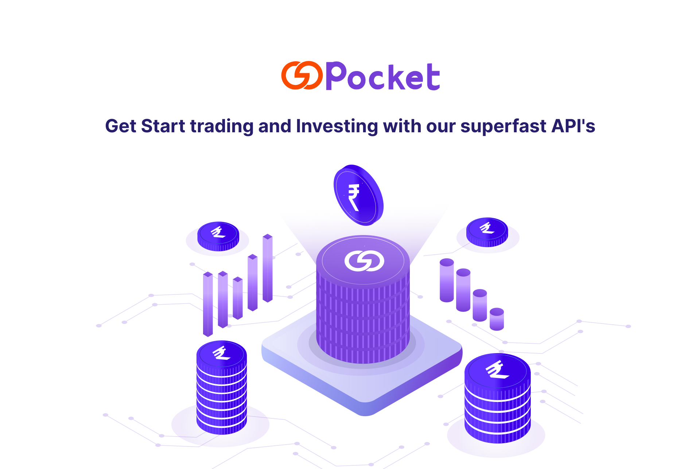

---

title: Introduction

---

# Introduction

## Getting Started

Gopocket is a collection of fast, high performing, low complexity and easy to understand trading APIs for you, the retail traders to build state of the art financial platforms which can be used for trading, investment, wealth generation, automation of trading strategies & execute algo based strategies.

It is a set of REST-like APIs that provide integration with our trading eco-system. You can Execute, Modify and Cancel Orders in real time, Manage Portfolio, access Live Market data feeds and Order status stream, view Funds & Balance, and build much more in the Capital Market space with our Open APIs.

Gopocket APIs offer resource-based URLs that accept JSON or form-encoded requests. The response is returned as JSON-encoded by using Standard HTTP response codes unless explicitly stated otherwise. The service calls are platform independent. To Jumpstart your development, toolkits are available in several Programming languages.

## Libraries & SDKs

Below is a list of pre-built client libraries for Gopocket Open APIs developed in popularly used programming languages that can be used to interact with the APIs without having to make raw HTTP calls.

- Python library (Official)
- JAVA SDK (Official)
- NodeJS SDK
- C# SDK

**Base URL**

The Base URL is the common URL used as a prefix for all API calls.

__https://web.gopocket.in/auth-rest/__

## API Versions

The current stable version of the Gopocket Open API is 1.0 and  All requests go to it by default. It is recommended that a specific version be requested explicitly for production applications as major releases may break older implementations. Major changes in the API will be released with new versions.

## Login

### For FinTech

**Registration as Partner:**

Partner login mechanisms are on-demand APIs provided by Gopocket to build innovative financial products to generate wealth via Investment or Trading such as Algo Trading, Portfolio Management and Trading Products. When the Gopocket customer logs in to Partner’s portal.

**Registration as a Vendor:**

To register as a Vendor, Please visit [web.gopocket.in](https://web.gopocket.in/developers/)

1.  Login using your  credentials.
2.  In the Apps sections, Create a new application.
3.  Fill out the mandatory details.
4.  Click "Save" to create a new app.
5.  An App Code (appCode) and API Secret (apiSecret) will be provided to the Vendor. This code is important and Confidential. DO NOT Share with anyone outside your organization.​
6.  The App will be activated by Gopocket Admin team after reviewing the details given by the Vendor. The Vendor API access will be provided after necessary approval.

**Implementation of SSO:**

1.  During User login, the Vendor should redirect the Gopocket user to [https://web.gopocket.in/?appcode](https://web.gopocket.in/?appcode)= along with the App Code as shown here in the url.
2.  User will be asked to login with their Gopocket credentials.
3.  After successful login, the user will be redirected to the URL provided by the Vendor (Provisions to provide / update the Redirect URL is provided in the Developers Login) along with User Authorization token (authCode) and User ID (userId).
4.  The Vendor will save the user authCode, UserId (userId) along with apiSecret to create a checkSum, which is the SHA-256 hash of userId + authCode + apiSecret.
5.  Vendor should send this checkSum to the URL : [https://web.gopocket.in/am/sso/vendor/auth/getUserDetails]() to get the User Session (userSession), which can be used to access all API end points.

### For Individual Traders

Individual traders can directly get their Access Token from web.Gopocket.co,subject to eligibility. The eligibility criteria to get Access Token is minimum 25 trading orders executed in the last 30days and this is inclusive of Futures, Options, Commodity, Currency & Equity-Intraday. Here's 

**How to get your Access Token:**

- Login to [web.gopocket.in](https://web.gopocket.in).
- Click on My Profile and navigate to Gopocket login page.

